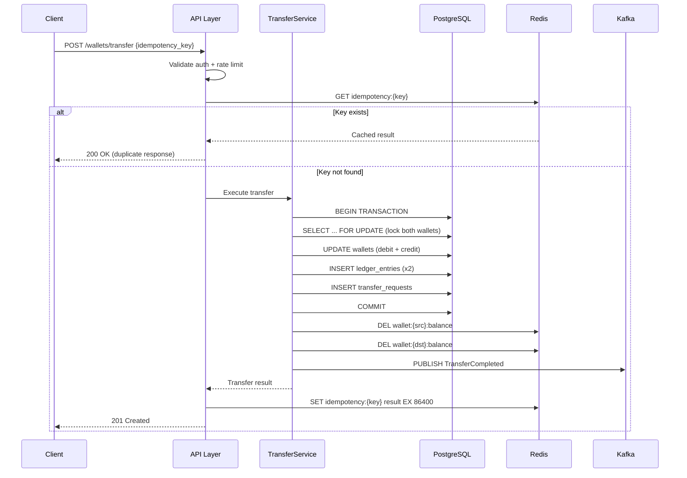
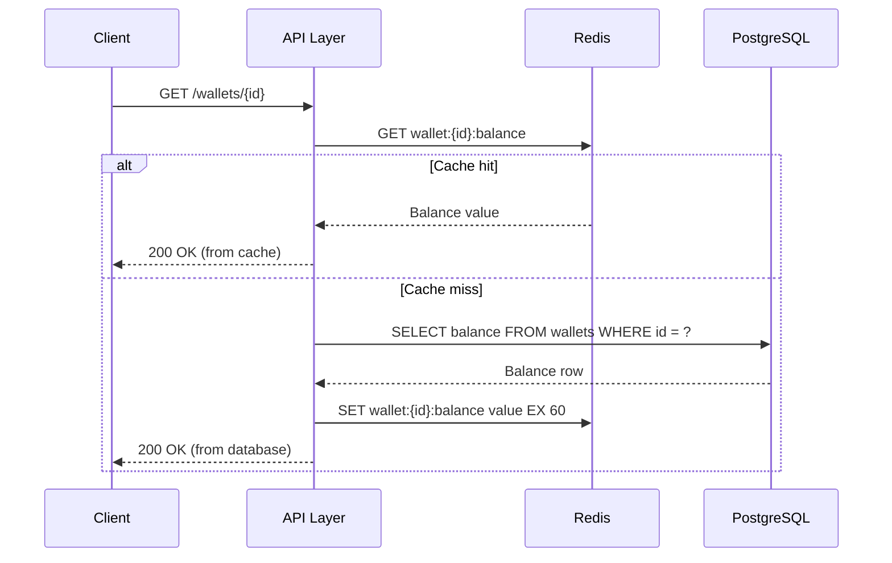
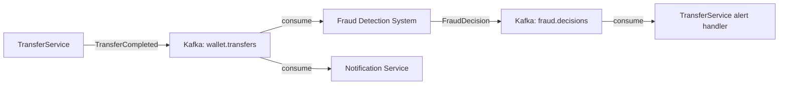

# Requirements — Digital Wallet System

---

## Functional Requirements

**FR-01** — The system shall allow a user to create a wallet associated with their account,
specifying a currency at creation time.

**FR-02** — The system shall allow a wallet owner to deposit funds into their wallet by
submitting a deposit request with an amount and an idempotency key.

**FR-03** — The system shall allow a wallet owner to transfer funds to another wallet,
identified by wallet ID, with a specified amount and idempotency key.

**FR-04** — The system shall reject any transfer where the source wallet's balance is
insufficient to cover the requested amount.

**FR-05** — The system shall reject any deposit or transfer with an amount less than or
equal to zero.

**FR-06** — The API must return the current confirmed balance for any wallet on request.

**FR-07** — The API must return a paginated list of transactions for a wallet, ordered by
timestamp descending, with cursor-based pagination.

**FR-08** — The system shall record a ledger entry for every balance movement, capturing
the direction (debit or credit), amount, and resulting running balance.

**FR-09** — The system shall process a transfer exactly once when the same idempotency
key is submitted multiple times, returning the original result on subsequent submissions.

**FR-10** — The system shall publish a `TransferCompleted` event to the event stream after
every successfully committed transfer.

---

## Non-Functional Requirements

### Availability

- **NFR-01** — The system shall maintain 99.9% uptime, allowing a maximum of ~8.7 hours
  of unplanned downtime per year.
- **NFR-02** — Scheduled maintenance windows shall not exceed 30 minutes and shall be
  communicated 24 hours in advance.

### Latency

- **NFR-03** — `POST /wallets/transfer` p95 latency ≤ 150ms, p99 ≤ 200ms under peak load.
- **NFR-04** — `GET /wallets/{id}` (balance read) p95 latency ≤ 20ms (cache hit),
  ≤ 50ms (cache miss).
- **NFR-05** — `GET /wallets/{id}/transactions` p95 latency ≤ 100ms for pages of up to
  50 transactions.

### Throughput

- **NFR-06** — The system shall sustain 500 transfer operations per second at peak load
  without degradation in latency targets.
- **NFR-07** — The system shall handle 50,000 daily active wallets with no per-user
  throttling below 10 requests per minute.

### Durability

- **NFR-08** — Zero tolerance for committed transaction data loss. Any transaction that
  receives a success response must be permanently recorded and recoverable.
- **NFR-09** — The ledger must be reconstructible from `ledger_entries` alone — no
  balance state outside the ledger is authoritative.

### Consistency

- **NFR-10** — Balance modifications are strongly consistent. A read immediately following
  a committed write must reflect the new balance.
- **NFR-11** — Cache reads may serve data up to 60 seconds stale. This is acceptable for
  balance display but not for transfer validation, which always reads from the primary.

### Security

- **NFR-12** — All API endpoints require a valid Bearer token. Unauthenticated requests
  receive 401.
- **NFR-13** — Rate limiting: 100 requests per minute per authenticated user; 10 transfer
  requests per minute per wallet.

---

## Estimated Traffic

| Metric                         | Estimate                            |
| ------------------------------ | ----------------------------------- |
| Registered users               | 500,000                             |
| Daily active users             | 50,000                              |
| Average transfers per user/day | 3                                   |
| Peak transfer rate             | 500 transfers/second                |
| Peak balance read rate         | 2,000 reads/second                  |
| Ledger entries per day         | ~300,000                            |
| Kafka events per day           | ~300,000 (one per transfer/deposit) |
| Average transfer payload size  | ~512 bytes                          |

---

## Data Flow

### Write Path — Transfer

### Read Path — Balance

### Event Flow — Downstream Consumers

---
